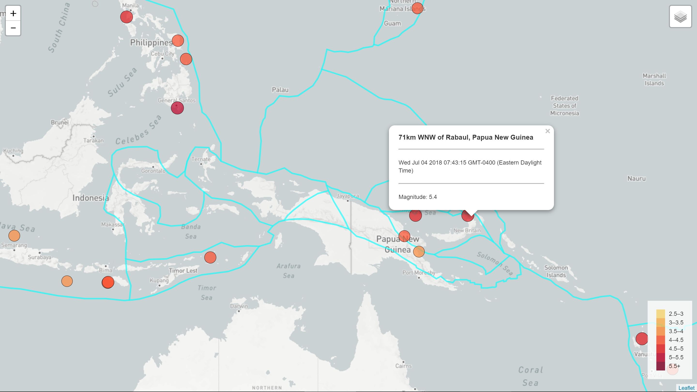

## Visualizing Earthquake Data with Leaflet Map
### M2.5+ Earthquakes in the Past 7 Days

* Use the data from the [USGS GeoJSON Feed](http://earthquake.usgs.gov/earthquakes/feed/v1.0/geojson.php)
* Use leaflet to show the earthquakes as circles (size and color deepens as magnitude increases) with tooltips
* Show tectonic plate lines
* Have three choices of maps: light, satellite, outdoors
* If you would like to run this, you must use your own mapbox token key

